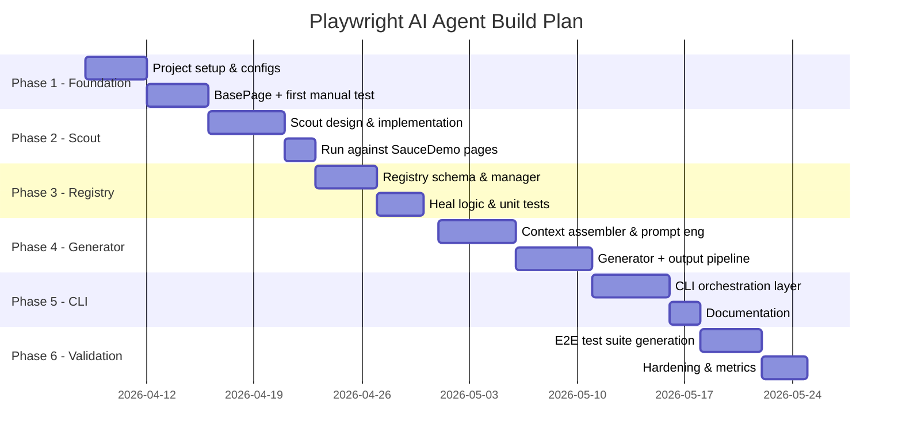

# Playwright AI Agent — Build Roadmap

## Your Arsenal

| Tool | Access | Best Use |
|---|---|---|
| **GitHub Copilot (Sonnet)** | VS Code, April | Inline code completion, writing repetitive boilerplate, quick file generation |
| **GitHub Copilot (Opus 4.6)** | VS Code, April | Complex multi-file edits, refactoring, in-editor agent mode tasks |
| **Antigravity (Sonnet)** | IDE, ongoing | Fast iteration, running commands, quick fixes, browser testing |
| **Antigravity (Opus 4.6)** | IDE, ongoing | Architecture decisions, system design, cross-file reasoning, reviews |
| **Claude Pro** | Web/API, from May | Long-context conversations, deep design sessions, prompt engineering for your agent's system prompt |

---

## Strategy: Which Tool When

```
┌─────────────────────────────────────────────────────────┐
│  THINKING / DESIGNING    →  Antigravity Opus / Claude Pro│
│  WRITING CODE            →  Copilot Sonnet (inline)      │
│  COMPLEX CODE CHANGES    →  Copilot Opus (agent mode)    │
│  RUNNING & DEBUGGING     →  Antigravity Sonnet           │
│  PROMPT ENGINEERING      →  Claude Pro (May)             │
│  REVIEWING & REFACTORING →  Antigravity Opus             │
└─────────────────────────────────────────────────────────┘
```

---

## Phase 1: Foundation (April Week 1-2)

> **Goal**: Go from 2 markdown files → a real project with runnable structure

### Tasks

| # | Task | Tool | Why |
|---|---|---|---|
| 1.1 | Initialize Node.js project (`npm init`, install Playwright) | **Antigravity Sonnet** | Fast command execution, project scaffolding |
| 1.2 | Create folder structure: `src/elements/`, `src/pages/`, `src/tests/`, `.agent/` | **Antigravity Sonnet** | Simple file operations |
| 1.3 | Build `BasePage.js` — shared page object base with Playwright's `page` fixture | **Copilot Opus** | Needs to understand your layer architecture from MASTER_MEMORY |
| 1.4 | Build `execution.config.js` — environment/URL config | **Copilot Sonnet** | Simple key-value config, fast inline completion |
| 1.5 | Build `testdata.config.js` with `TestData.get()` helper | **Copilot Sonnet** | Straightforward utility class |
| 1.6 | Create empty `registry.json`, `method_index.json`, `pending_patches.json` in `.agent/` | **Antigravity Sonnet** | File creation + JSON structure |
| 1.7 | Write first manual test against SauceDemo login to validate the framework compiles and runs | **Copilot Opus** | Multi-file coordination (elements + page + test) |

### Deliverable
```
playwright-agent/
├── src/
│   ├── elements/
│   │   └── Login.elements.js
│   ├── pages/
│   │   ├── BasePage.js
│   │   └── Login.page.js
│   └── tests/
│       └── login/
│           └── login_happy_path.spec.js
├── .agent/
│   ├── registry.json
│   ├── method_index.json
│   └── pending_patches.json
├── execution.config.js
├── testdata.config.js
├── master_memory.md
├── project_context.md
└── playwright.config.js
```

> [!IMPORTANT]
> **Do NOT move to Phase 2 until you can run `npx playwright test` and see a green login test.** The foundation must be solid before adding AI layers.

---

## Phase 2: Scout (April Week 2-3)

> **Goal**: Build the DOM discovery tool that feeds element data to the agent

### Tasks

| # | Task | Tool | Why |
|---|---|---|---|
| 2.1 | Design Scout output schema (`scout_summary.json`) | **Antigravity Opus** | Schema design needs architectural reasoning |
| 2.2 | Write `scout.js` — a Playwright script that navigates to a page, extracts all interactive elements (buttons, inputs, links, selects), and captures: tag, role, label, testId, visible text, attributes | **Copilot Opus** | Complex DOM traversal logic, multi-attribute extraction |
| 2.3 | Add deduplication: if element already exists in `registry.json`, skip it (only send unknowns) | **Copilot Sonnet** | Simple filter/diff logic |
| 2.4 | Build CLI wrapper: `node scout.js --url <url> --page <pageName>` | **Copilot Sonnet** | Basic CLI arg parsing |
| 2.5 | Run Scout against SauceDemo: Login, Inventory, Cart, Checkout pages | **Antigravity Sonnet** | Command execution + validation |
| 2.6 | Review Scout output quality, refine extraction logic | **Antigravity Opus** | Needs judgment on what data is useful vs noise |

### Scout Output Example
```json
{
  "page": "Login",
  "url": "https://www.saucedemo.com/",
  "scanned_at": "2026-04-15T10:00:00Z",
  "elements": [
    {
      "tag": "input",
      "role": "textbox",
      "label": "Username",
      "testId": "username",
      "attributes": { "id": "user-name", "type": "text", "placeholder": "Username" },
      "in_registry": false
    }
  ]
}
```

---

## Phase 3: Registry & Self-Healing (April Week 3-4)

> **Goal**: Build the selector health tracking system with the circuit breaker

### Tasks

| # | Task | Tool | Why |
|---|---|---|---|
| 3.1 | Design `registry.json` schema with health states (HEALTHY/DEGRADED/BROKEN/QUARANTINE) | **Antigravity Opus** | Critical architecture, needs to match MASTER_MEMORY contract exactly |
| 3.2 | Build `registry-manager.js` — CRUD operations on registry entries, state transitions, success_rate calculation | **Copilot Opus** | Complex state machine logic |
| 3.3 | Build `heal.js` — attempts to find a new working selector when one is BROKEN, updates heal_attempts counter | **Copilot Opus** | Needs to understand locator priority tiers |
| 3.4 | Implement QUARANTINE logic — after 2 failed heals, lock the entry | **Copilot Sonnet** | Simple conditional, Opus already built the structure |
| 3.5 | Build `registry-reporter.js` — CLI tool that shows registry health summary | **Copilot Sonnet** | Table formatting, read-only |
| 3.6 | Write unit tests for state transitions | **Antigravity Sonnet** | Fast test execution + iteration |

### Registry Entry Example
```json
{
  "Login.usernameInput": {
    "page": "Login",
    "element": "usernameInput",
    "selector": "getByTestId('username')",
    "tier": 2,
    "success_rate": 0.95,
    "heal_attempts": 0,
    "state": "HEALTHY",
    "last_verified": "2026-04-20T10:00:00Z",
    "history": []
  }
}
```

---

## Phase 4: Code Generator Core (May Week 1-2) 🧠

> **Goal**: Build the actual LLM-powered code generation engine

> [!IMPORTANT]
> This is where **Claude Pro** becomes your primary design tool. You'll be engineering the system prompt and testing generation quality in long-context conversations.

### Tasks

| # | Task | Tool | Why |
|---|---|---|---|
| 4.1 | Build `context-assembler.js` — loads all 5 context files in order, validates staleness, builds the full prompt | **Copilot Opus** | Multi-file loading with validation logic |
| 4.2 | Refine `MASTER_MEMORY.md` as a system prompt — test it with Claude Pro in conversation, iterate on edge cases | **Claude Pro** | Long-context prompt engineering, can paste full examples and test outputs |
| 4.3 | Build `generator.js` — sends assembled context + user prompt to Claude API, parses JSON envelope response | **Copilot Opus** | API integration + JSON parsing with error handling |
| 4.4 | Build `output-validator.js` — validates the returned JSON envelope matches the output contract schema | **Copilot Sonnet** | JSON schema validation, straightforward |
| 4.5 | Build `file-writer.js` — takes validated output and writes/updates files to the correct paths | **Copilot Sonnet** | File I/O operations |
| 4.6 | Build `index-sync.js` — processes `index_delta` from output, merges into `method_index.json` | **Copilot Sonnet** | JSON merge logic |
| 4.7 | Build `patch-manager.js` — manages `pending_patches.json` staging → promotion to `testdata.config.js` | **Copilot Opus** | Concurrency-safe write logic |
| 4.8 | End-to-end test: prompt "Generate login happy path test" → get valid output → files written → test passes | **Antigravity Opus** | Full pipeline validation, needs reasoning about failures |

### API Decision

> [!WARNING]
> **You need API access to Claude for the generator to work at runtime.** Claude Pro (web) is great for prompt engineering, but the agent itself needs to call the API programmatically. Options:
> 1. **Claude API key** (pay-per-token) — cleanest, ~$0.01-0.03 per test generation with Sonnet
> 2. **Use Copilot's API** via VS Code extension API — free but limited, tied to IDE
> 3. **Local model** (e.g., Ollama + CodeLlama) — free but lower quality
>
> Recommend: **Claude API with Sonnet** for runtime generation. Your MASTER_MEMORY constrains output enough that Sonnet handles it well, and it's ~10x cheaper than Opus per call.

---

## Phase 5: Orchestration & CLI (May Week 2-3)

> **Goal**: Tie everything together into a usable developer tool

### Tasks

| # | Task | Tool | Why |
|---|---|---|---|
| 5.1 | Build `agent-cli.js` — main entry point with commands: `scout`, `generate`, `heal`, `status` | **Copilot Opus** | Multi-command CLI architecture |
| 5.2 | `agent scout <url> <pageName>` — runs Scout, updates registry with new elements | **Copilot Sonnet** | Wiring existing modules |
| 5.3 | `agent generate "<prompt>"` — assembles context, calls LLM, writes output | **Copilot Sonnet** | Wiring existing modules |
| 5.4 | `agent heal [--page <name>]` — runs heal cycle on BROKEN selectors | **Copilot Sonnet** | Wiring existing modules |
| 5.5 | `agent status` — shows registry health, pending patches, index staleness | **Copilot Sonnet** | Read-only reporting |
| 5.6 | Add `--dry-run` flag to generate (shows output without writing files) | **Copilot Sonnet** | Simple flag |
| 5.7 | Write README.md with setup + usage instructions | **Antigravity Opus** | Documentation needs full project context |

### CLI Usage
```bash
# Discover elements on a page
node agent-cli.js scout https://www.saucedemo.com/ Login

# Generate a test
node agent-cli.js generate "Create a test that logs in with locked_out_user and verifies the error message"

# Check system health
node agent-cli.js status

# Heal broken selectors
node agent-cli.js heal --page Login
```

---

## Phase 6: Validation & Hardening (May Week 3-4)

> **Goal**: Prove it works end-to-end against SauceDemo, fix edge cases

### Tasks

| # | Task | Tool | Why |
|---|---|---|---|
| 6.1 | Generate full test suite: login (happy + error), inventory sort, add to cart, checkout flow | **Your Agent** | This IS the test — your agent generates these |
| 6.2 | Run all generated tests in CI (GitHub Actions) | **Antigravity Sonnet** | Workflow file creation + debugging |
| 6.3 | Intentionally break a selector in SauceDemo (if possible) or simulate by editing registry — verify heal cycle works | **Antigravity Opus** | Needs reasoning about failure scenarios |
| 6.4 | Test QUARANTINE flow — verify agent refuses to generate for quarantined selectors | **Antigravity Sonnet** | Execution + validation |
| 6.5 | Test stale index handling — set `"stale": true`, verify warning appears in output | **Antigravity Sonnet** | Quick check |
| 6.6 | Measure: tokens per generation, time per generation, test pass rate | **Antigravity Opus** | Analysis + reporting |
| 6.7 | Update `project_context.md` with learnings | **Claude Pro** | Reflection, long-form writing |

---

## Timeline Summary



---

## Budget Estimate (API Costs)

| Activity | Model | Est. Calls | Cost |
|---|---|---|---|
| Prompt engineering (Phase 4) | Claude Pro subscription | Unlimited | ~$20/mo |
| Runtime generation (per test) | Claude Sonnet API | ~50 during dev | ~$0.50-1.50 total |
| Scout (no LLM needed) | N/A | 0 | $0 |
| Heal attempts | Claude Sonnet API | ~20 during dev | ~$0.20-0.60 |
| **Total estimated dev cost** | | | **~$22-25** |

> [!TIP]
> Your design is **inherently cost-efficient**. Scout uses zero API calls (pure Playwright DOM extraction). Registry lookups are local JSON reads. The LLM is only called for actual code generation. This is better cost architecture than most agent projects.

---

## Risk Checklist

- [ ] **No API key yet** — Decide on Claude API vs alternative before Phase 4
- [ ] **SauceDemo could change** — It's a demo site, rarely changes, but pin your assumptions
- [ ] **800-token limit** — May need adjustment after real generation testing
- [ ] **method_index.json merge conflicts** — If you generate tests in parallel, the delta merge could collide
- [ ] **No rollback mechanism** — If generated code is wrong, there's no undo. Consider git-based rollback

---

## Quick Start (Do This Today)

```bash
# 1. Initialize the project
cd "d:\Github\My Agent\Playwright"
npm init -y
npm install @playwright/test
npx playwright install

# 2. Create the folder structure
mkdir src\elements src\pages src\tests\.login .agent

# 3. Move your specs into the project
# master_memory.md and project_context.md are already here ✓
```

**Start with Phase 1, Task 1.1. Everything else follows.**
